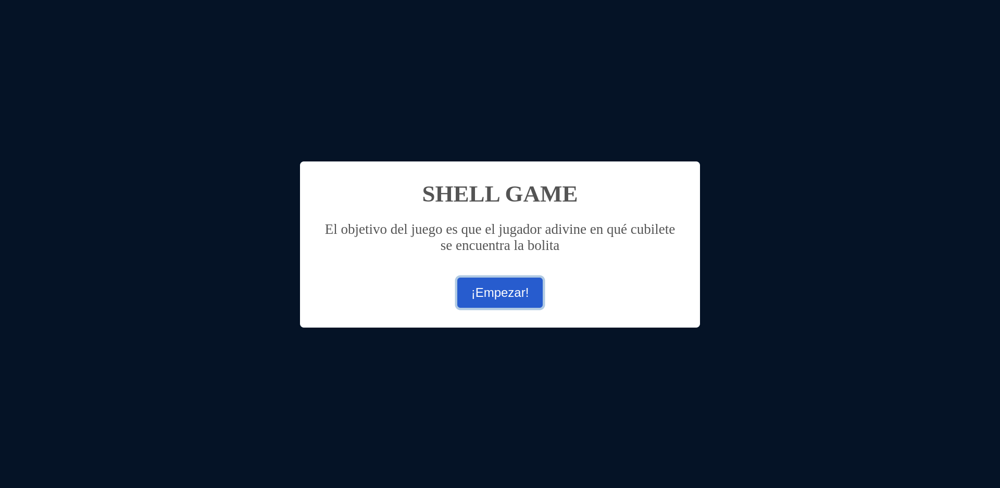
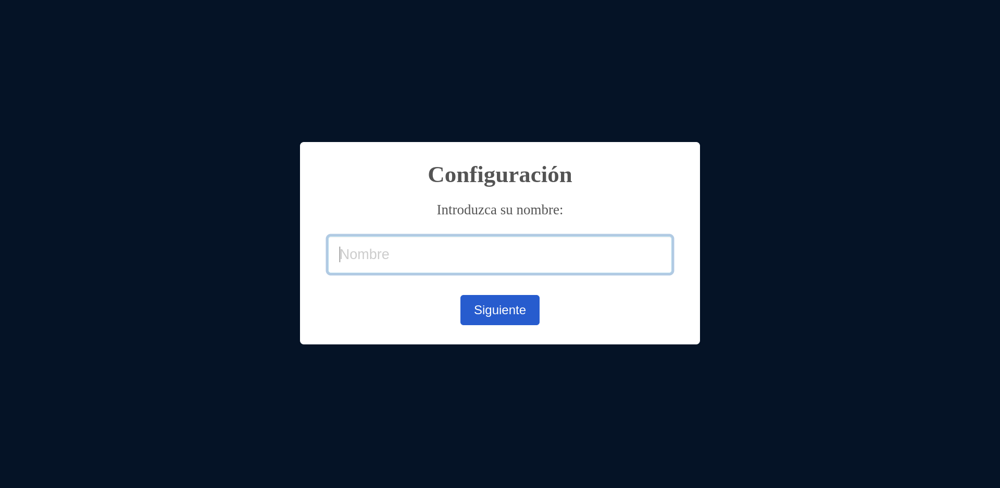
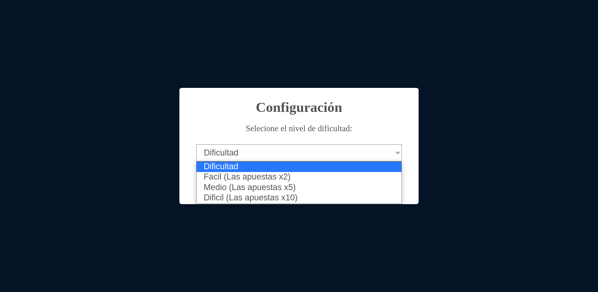
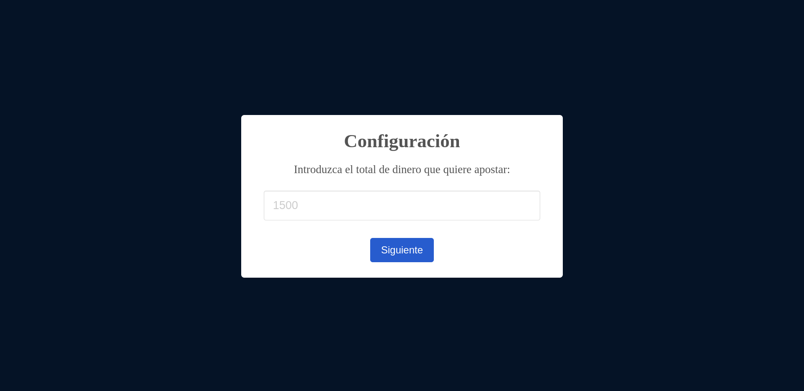
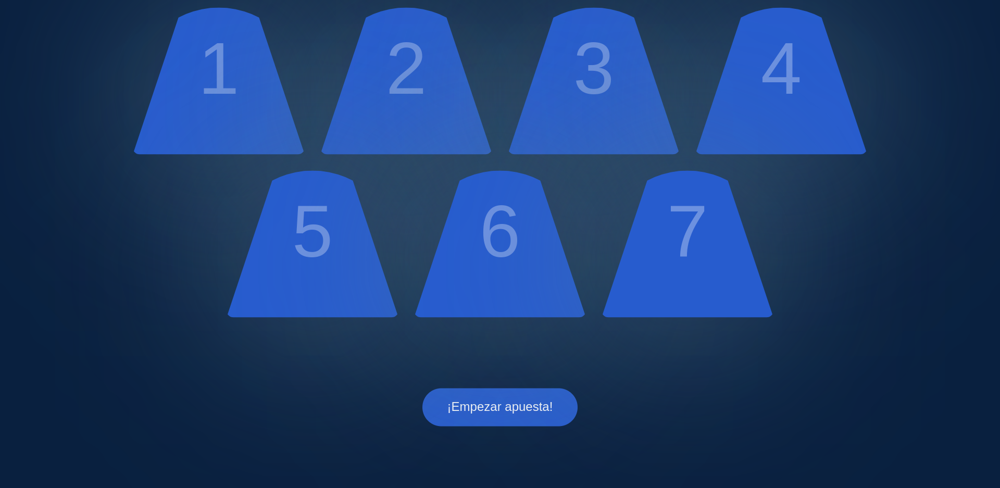
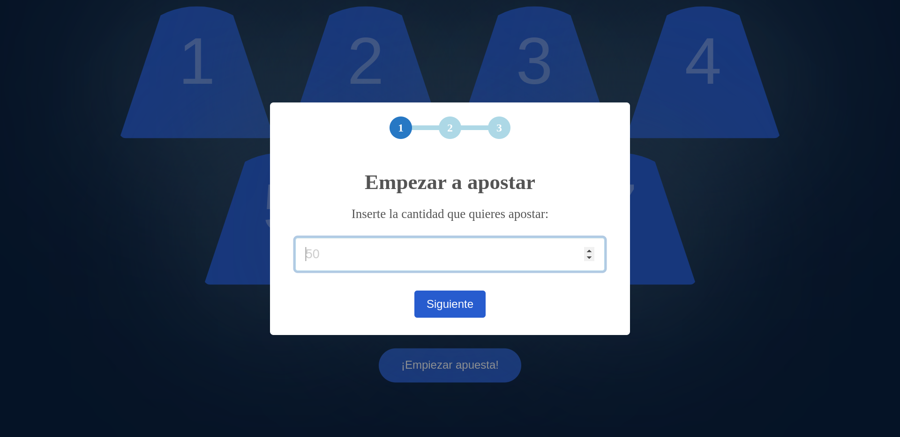
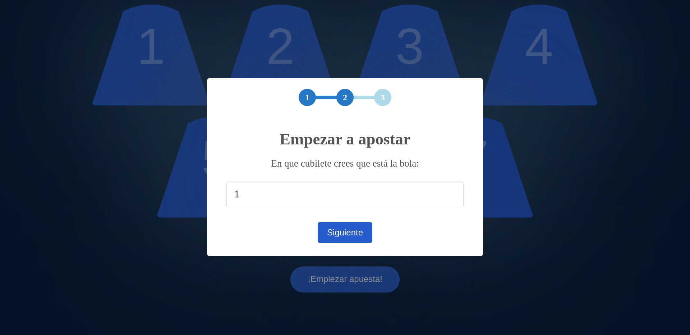
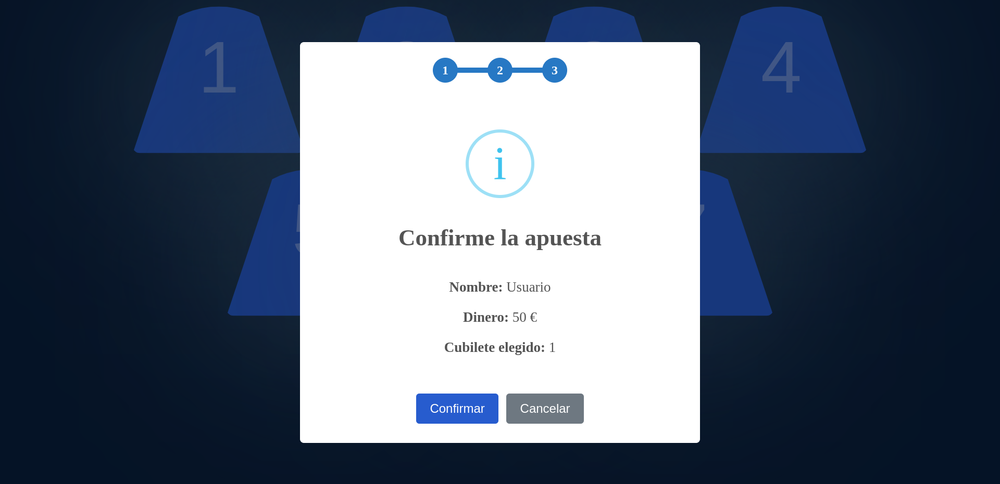

# SHELL-GAME

 ***Idioma***
- 🇪🇸 Español
- [🇺🇸 English](https://github.com/ern3stma/SHELL-GAME)

# Índice

- [Resumen](#resumen)
- [Guía](#guía)
- [Galería](#galería)

# Resumen
  He creado un pequeño juego de adivinar en que cubilete se esconde la pelotita, el juego está enfocado a un casino que insertas
  dinero para apostar, si tienes suerte puedes ir ganando dinero o, por el contrario, perderlo todo.
 
 # Guía
 1. Nos da un breve resumen del juego.
  \
  \
  
  
 2. Le pedimos un nombre de usuario.
  \
  \
  
 
3. Seleccionamos la dificultad que influirá en el número de bloques pero también en la bonificación de ganancia.
  \
  \
  
  
4. Añadimos el saldo de dinero que queremos añadir al juego.
  \
  \
  
  
5. Nos muestra todos los cubiletes disponibles, para continuar hay que pulsar él ***¡Empezar apuesta!***.
  \
  \
  
  
6. Añadiremos la cantidad que queremos apostar.
  \
  \
  
  
7. Seleccionaremos un cubilete.
  \
  \
  
  
8. Nos dará un breve resumen de nuestra apuesta, en este caso podemos pulsar, confirmar y ver si ganamos o perdimos, pero también tendremos el botón de *Cancelar* por si no estamos seguros.
  \
  \
  
  
 # Galería
> *Proximamente...*
 
