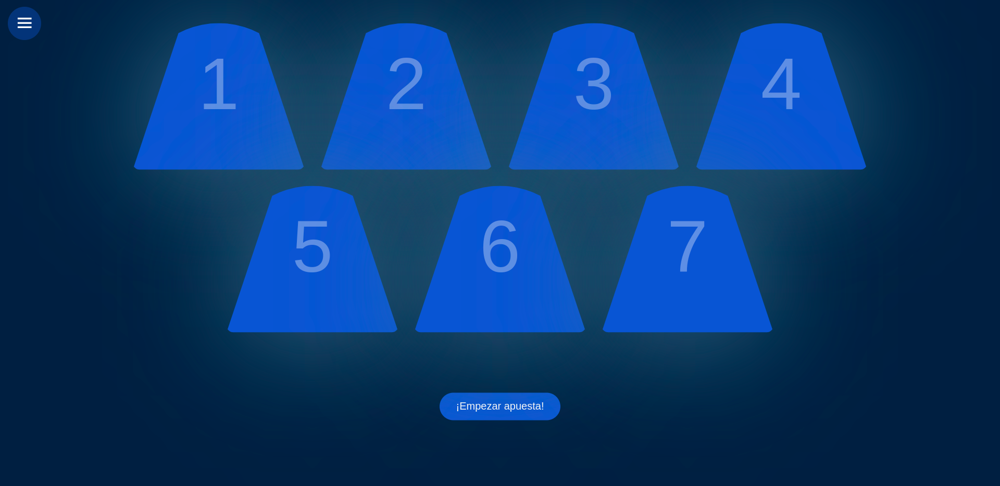
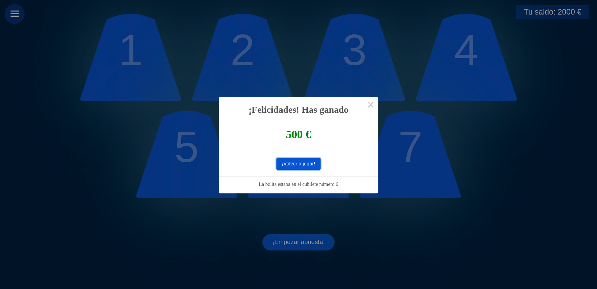
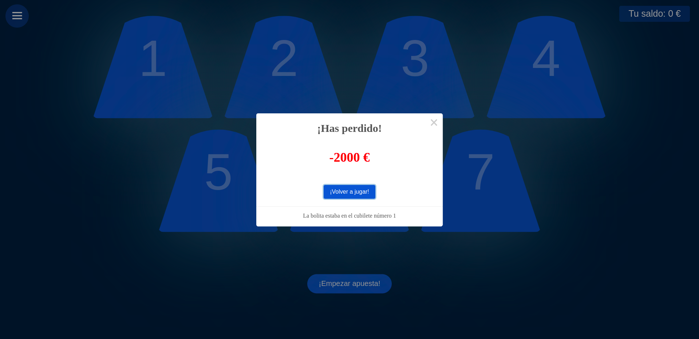

# SHELL-GAME

 ***Language***
- [🇪🇸 Español](README.es.md)
- 🇺🇸 English

# Index

- [Overview](#overview)
- [Guide](#guide)

# Overview
  A small guessing game in which the cube hides the ball, the game focuses on a casino in which you insert money to bet, if you are lucky you can go winning money or, on the contrary, lose everything.
 
 # Guide
 1. It gives us a brief summary of the game.
  \
  \
  
  
 2. We ask for a username.
  \
  \
  
 
3. We select the difficulty that will influence the number of blocks but also the winning bonus.
  \
  \
  
  
4. We add the balance of money that we want to add to the game.
  \
  \
  
  
5. It shows us all the available cubes, to continue you have to click ***¡Empezar apuesta!***.
  \
  \
  
  
6. We will add the amount we want to bet.
  \
  \
  
  
7. We will select a bucket.
  \
  \
  
  
8. It will give us a brief summary of our bet, in this case we can click, ***Confirm*** and see if we won or lost, but we will also have the ***Cancel*** button in case we are not sure.
  \
  \
  
  
9. If we are lucky we can get it right and receive a reward or, on the contrary, we can lose everything.
  \
  \
  
  
  
10. If we lose everything it will give us the possibility to add more money and continue playing.
  \
  \
  
  
  
  
